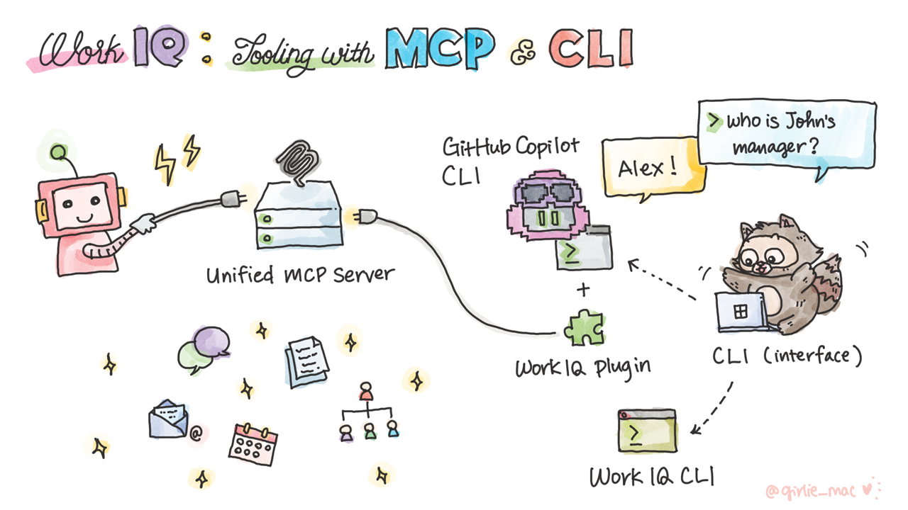

# Episode 3: Work IQ: Tooling with MCP & Copilot CLI

📅 **July 16, 2026 at 9 AM PT** | 📺 [Watch the session](https://aka.ms/iq-series/work-iq/episode3) | 📂 [Try the cookbook](./cookbook/)

## 🎥 Session Summary

### 🎬 Executive Introduction

Jared Spataro introduces Work IQ execution layer over the MCP protocol with its security model.

### 💬 Tech Talk

Paolo Pialorsi walks you through the idea of the MCP protocol in general and in Work IQ, explaining:

- The MCP (Model Context Protocol) protocol
- The Unified MCP Server of Work IQ
- How to leverage Work IQ MCP in GitHub Copilot CLI with the Work IQ plugin

### 🖍 Doodle Summary

A visual summary of key takeaways by Tomomi Imura, showing how the unified MCP Server of Work IQ fits in the Work IQ architecture.

## 🧪 Try the Lab

Ready to get hands-on? Head to the [Episode 3 cookbook](./cookbook/) for prerequisites, deployment instructions, and a step-by-step guidance.

## 🔗 Learn More

- 📖 [Work IQ overview](https://learn.microsoft.com/en-us/microsoft-365/copilot/extensibility/work-iq)
- 📚 [Copilot Dev Camp - Work IQ](https://microsoft.github.io/copilot-camp/pages/work-iq/)

## 💬 Community

- Ask your questions in our [Discussions](https://aka.ms/iq/discussions)

### 🎉 Congratulations! You've completed The Work IQ Series. Continue exploring Foundry IQ and join our [Discussions](https://aka.ms/iq/discussions) to share your learnings!
